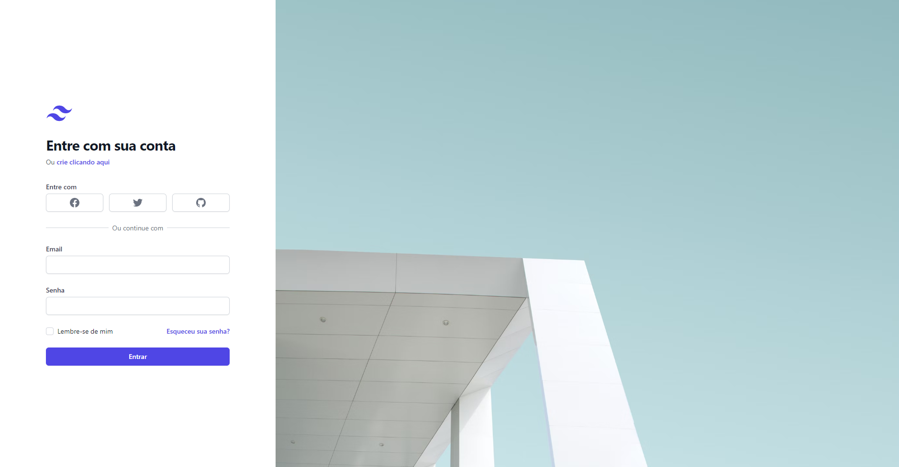

# Nome do projeto



> Este é um trabalho de Desenvolvimento web para criar uma tela de login.

Por conta de não encontrar uma ferramenta gratuita para hospedar o backend, só temos o frontend com um login estático.

Email: admin@admin.com

Senha: admin

## 💻 Pré-requisitos

Antes de começar, verifique se você atendeu aos seguintes requisitos:

<!---Estes são apenas requisitos de exemplo. Adicionar, duplicar ou remover conforme necessário--->

- Você instalou a versão mais recente de NPM ou Yarn

## 🚀 Instalando LoginPage

Para instalar o LoginPage, siga estas etapas:

Linux e macOS:

```
cd \LoginPage
npm install
```

Windows:

```
cd \LoginPage
npm install
```

## ☕ Usando LoginPage

Para usar LoginPage, siga estas etapas:

```
npm run dev
```

## 📫 Contribuindo para LoginPage

Para contribuir com LoginPage, siga estas etapas:

1. Bifurque este repositório.
2. Crie um branch: `git checkout -b <nome_branch>`.
3. Faça suas alterações e confirme-as: `git commit -m '<mensagem_commit>'`
4. Envie para o branch original: `git push origin LoginPage / main`
5. Crie a solicitação de pull.

Como alternativa, consulte a documentação do GitHub em [como criar uma solicitação pull](https://help.github.com/en/github/collaborating-with-issues-and-pull-requests/creating-a-pull-request).

## 🤝 Colaboradores

Agradecemos às seguintes pessoas que contribuíram para este projeto:

<table>
  <tr>
    <td align="center">
      <a href="https://github.com/TakashiNishii">
        <br>
        <sub>
          <b>Ygor Takashi Nishi</b>
        </sub>
      </a>
    </td>
    <td align="center">
      <a href="https://github.com/Filho-da-Prata">
        <br>
        <sub>
          <b>Gabriel Silverson Gomes</b>
        </sub>
      </a>
    </td>
  </tr>
</table>

## 📝 Licença

Esse projeto está sob licença. Veja o arquivo [LICENÇA](LICENSE) para mais detalhes.

[⬆ Voltar ao topo](#nome-do-projeto)<br>
